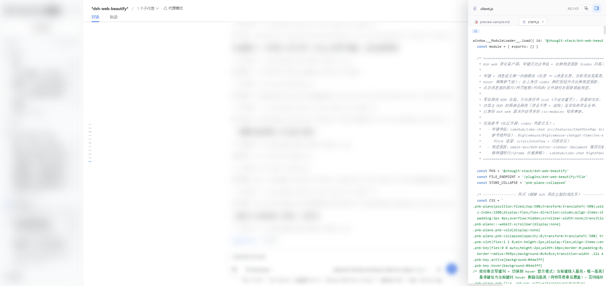
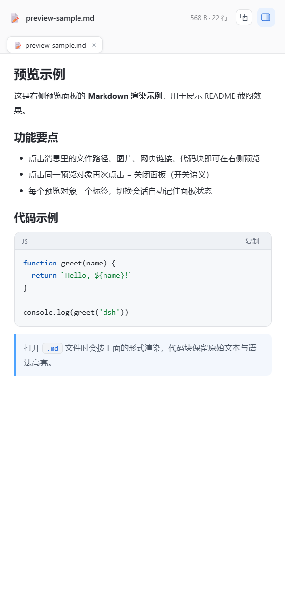
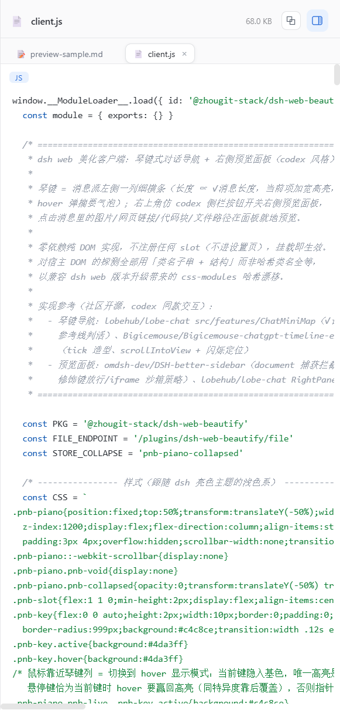

# dsh-web-beautify

> DeepSeek Harness Web 美化插件：**钢琴键对话导航** + **右侧预览面板**。
> 装进 dsh web profile 即可用——零依赖、不注册设置页、无外部网络请求。



> 例图中宿主侧的会话内容已模糊处理；左侧琴键条、右侧预览面板（多标签 + 代码高亮）均为插件真实渲染。

## 功能

### 琴键式对话导航

- 消息列左侧一条细琴键：**每条消息一个键**，长度 ∝ 消息长度
- 点击琴键跳到对应消息；hover 弹出内容摘要气泡
- 滚动对话时当前消息的琴键同步高亮（滚动同步走二分查找 + 增量更新，稳态零成本）
- 琴键条可整体收起（状态持久化）

### 右侧预览面板

点击消息里的内容，右侧滑出面板就地预览：

| 内容 | 预览方式 |
| --- | --- |
| 图片 | 直接预览 |
| 外部网页链接 | 面板内嵌 iframe（拦截宿主的新窗口打开） |
| 代码块 / 文件 | 语法高亮 + 一键复制 |
| `.md` | Markdown 渲染（标题 / 列表 / 表格 / 代码块 / mermaid 图） |
| `.pdf` | 面板内 iframe |

- **开关语义**：点击同一预览对象再次点击 = 关闭面板（文件不存在的错误态同样适用）
- **多标签**：每个预览对象一个标签，切换保留内容与滚动位置，× 关闭单个标签
- **会话独立记忆**：面板开关状态与标签按会话独立保存；切换会话时恢复打开带滑入动画、关闭瞬时完成
- 面板宽度可拖拽调整（持久化），对话列自动推挤平移

| Markdown 渲染 | 代码预览（多标签） |
| --- | --- |
|  |  |

## 安装

**要求**：dsh（web 模式）、Node `^22.19.0 || >=24.0.0`、pnpm（近版即可）。

插件通过 dsh web profile 安装——profile（`~/.dsh/profiles/web/`）就是一个标准 pnpm 项目。

### 方式一：tgz 安装（当前可用）

1. 从本仓库根目录取发布包 `zhougit-stack-dsh-web-beautify-<版本>.tgz`
   （或自行构建：clone 本仓库后 `pnpm pack`）
2. 拷贝到 `~/.dsh/local-packages/`
3. 编辑 web profile 的 `package.json`，添加依赖并登记 bundle：

   ```json
   {
     "dependencies": {
       "@zhougit-stack/dsh-web-beautify": "file:C:/Users/<你的用户>/.dsh/local-packages/zhougit-stack-dsh-web-beautify-0.5.6.tgz"
     },
     "dsh": {
       "profile": {
         "bundles": ["@zhougit-stack/dsh-web-beautify"]
       }
     }
   }
   ```

   > 已有其他 bundle 时把包名追加进数组即可；Linux/macOS 用 `file:` + 绝对路径。
4. 在 profile 目录执行 `pnpm install`，重启 dsh。

### 方式二：npm 安装（发布后可用）

包发布到 npm registry 后，profile 依赖直接引用 registry 版本：

```json
{
  "dependencies": {
    "@zhougit-stack/dsh-web-beautify": "0.5.6"
  }
}
```

`pnpm install` + 重启即可。

## 使用

| 操作 | 效果 |
| --- | --- |
| 点击消息里的图片 / 外链 / 代码块 / 文件路径 | 右侧预览 |
| 再次点击同一预览对象 | 关闭面板（开关） |
| ✕ / Esc / 右上角开关胶囊 | 关闭面板 |
| 拖拽面板左缘 | 调整宽度（持久化） |
| 左侧琴键 | 点击跳转、hover 摘要、滚动同步高亮 |
| 标签条 × | 关闭该预览标签 |

文件预览端点仅监听回环地址（127.0.0.1），只读，文本 2MB / 40 万字符上限；相对路径先按当前会话 cwd 解析，缺省回退 `$DSH_HOME/workspace`。

## 开发

```bash
node --check lib/client.js          # 客户端语法检查
node test/endpoint-cwd.test.mjs     # 文件端点单测（cwd 解析 / 404 / 绝对路径）
node test/mermaid-cache.test.mjs    # mermaid 静态端点单测（ETag / 304 / 403）
pnpm pack --pack-destination .      # 打 tgz 发布包
```

- `test/*.js` 是 Playwright 页面函数（签名 `async (page) => {...}`），对着已打开的 dsh web 页面运行
- 客户端 `lib/client.js` 为零依赖浏览器 IIFE，经 `window.__ModuleLoader__.load` 挂载，注册 id 必须等于包名
- mermaid 运行时（`lib/mermaid.min.js`，约 2.7MB）随仓库内置，服务端静态端点供给（no-cache + ETag 304 重校验），客户端首用才拉取

## License

[MIT](./LICENSE)
