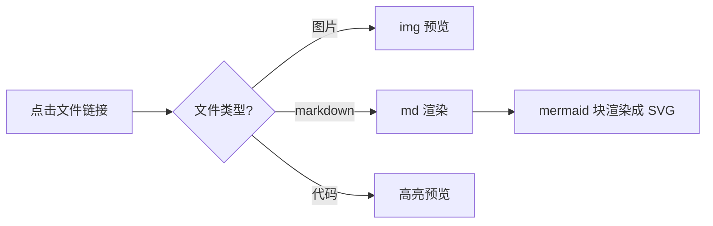
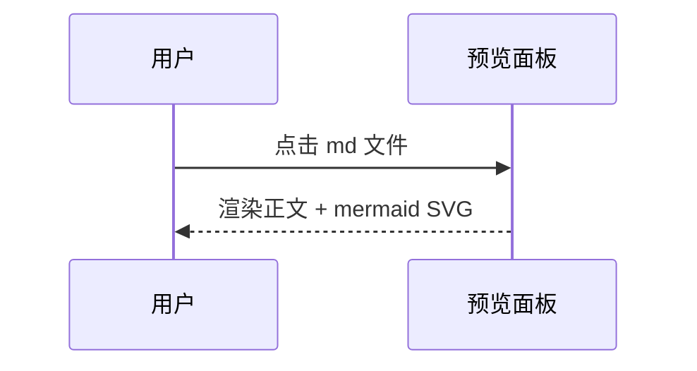

# mermaid 渲染验证

下方是一个流程图围栏块：

```mermaid
flowchart LR
  A[点击文件链接] --> B{文件类型?}
  B -->|图片| C[img 预览]
  B -->|markdown| D[md 渲染]
  B -->|代码| E[高亮预览]
  D --> F[mermaid 块渲染成 SVG]
```

以及一个时序图：

```mermaid
sequenceDiagram
  participant U as 用户
  participant P as 预览面板
  U->>P: 点击 md 文件
  P-->>U: 渲染正文 + mermaid SVG
```

正文其余部分应保持正常 markdown 排版。
